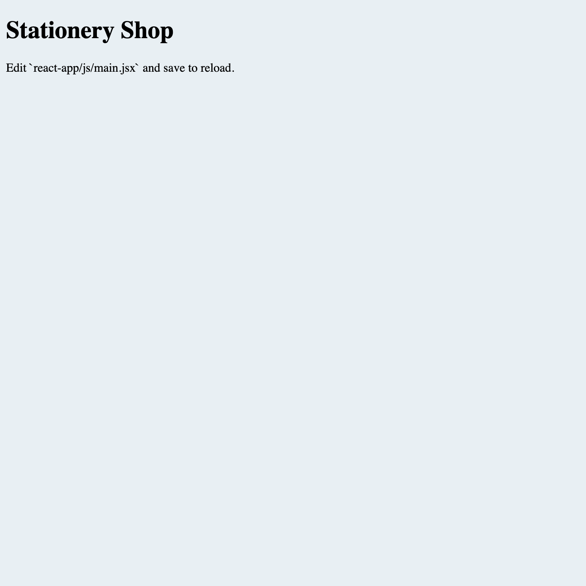

# Stationery Shop

The project is a web application for the stock control of a stationery shop, built with Django and React.

---

## Overview of the project

This project was built using Django and React. Django serves both the frontend and the backend. The frontend, served on localhost:8000, is a react app compiled by [vite](https://vitejs.dev/guide/). The backend, served on localhost:8000/api/, is built with Django Rest Framework, and exposes Django Admin on localhost:8000/admin/.

## Setup

Go ahead and make sure you have all of them and install the missing dependencies, in order to setup this project we require:

- make
- [python >= 3.6](https://www.python.org/downloads/)
- [poetry >= 1.2.2](https://github.com/python-poetry/install.python-poetry.org)
- [nvm](https://github.com/nvm-sh/nvm#installing-and-updating)
- [nodejs >= 18](https://nodejs.org/pt-br/)

On Ubuntu>=18.04, you also need:

- libpq-dev
- python3-dev

To get it up, clone the project, then copy the `.env.example` file to `.env`, so that the django app has access to environment variables via python-decouple, then run `make install_dependencies` to install Python and Node dependencies.

## Running it

After installing, when you want to run the project locally, be sure to have your virtualenv active (running `poetry shell` from the project folder) and nvm set to the correct node version (by running `nvm use` on the project folder). If nvm is not found, try restarting your terminal or reading through the installation step for NVM: <https://github.com/nvm-sh/nvm#installing-and-updating>

Since nvm can be a little fiddly, if you have any issues with it, [try reading their documentation](https://github.com/nvm-sh/nvm) on how to use it.

For development purposes, the database engine used in this project is SQlite. So before running the servers, you will need to migrate and load stub data on the database by running:

```sh
$ make migrate
```

If you want to create your own products, you can do so via `http://localhost:8000/admin/` by using the `admin:admin` superuser to access it.

Finally, to run django and vite in parallel for development, just run:

```sh
$ make run
```

After running it, you should be able to open the following url: `http://localhost:8000/`, the routing is done in Django that's why you need to open this project using port **:8000** instead of :3000.

Here are two screenshots from the things you should make sure the project ran successfully:

**Front-end running at `'http://localhost:8000'`:**


**Backend-end running at `'http://localhost:8000/admin/'`:**


### (optional) Running redis server on docker-compose

If you need to run Redis, we have a docker-compose file that can help you managing the required infra.
To create all the images and run them as a daemon, you have to have docker-compose installed and run:

```
$ docker-compose up -d
```

## Testing it

For python tests, run:

```sh
$ make test
```

For coverage report, run:

```sh
$ make cov
```

Your default browser will open with the report for the tests, if all tests pass.

For javascript unit tests, run:

```sh
$ npm test
```

For end to end tests built with [Cypress](https://www.cypress.io/), run:

```sh
$ make run_e2e
```

## API Specs

### `GET 'http://localhost:8000/api/inventory/'`

The endpoint is only accessible via **GET** and it lists the products in the inventory. A valid **200** response should have the following JSON body:

```
[
  {
    "name": "Pencil",
    "description": "Graffiti Pencil",
    "code": "P-0142",
    "category": "Pens and Pencils",
    "available_quantity": 150,
  },
  {
    "name": "Pen 0.4",
    "description": "0.40mm Ink Pen",
    "code": "P-0156",
    "category": "Pens and Pencils",
    "available_quantity": 40,
  },
  {
    "name": "Tri-color Ink Cartridges",
    "code": "P-1005",
    "category": "Printer Cartridges",
    "available_quantity": 20,
    "description": "Tri-color Ink Cartridges for HP printers"
  }
  ...
]
```

### `GET 'http://localhost:8000/api/inventory/<code>/'`

The endpoint is only accessible via **GET** and it returns the detail of the product in the inventory with the corresponding code. A valid **200** response for the url `/api/inventory/P-1005/` will have the following JSON as its body:

```
{
  "name": "Tri-color Ink Cartridges",
  "code": "P-1005",
  "available_quantity": 20,
  "description": "Tri-color Ink Cartridges for HP printers"
  "history": [
    {
      "quantity_in": 20,
      "quantity_out": 10,
      "date": "2021-03-12"
    },
    {
      "quantity_in": null,
      "quantity_out": 5,
      "date": "2021-03-14"
    },
    {
      "quantity_in": 80,
      "quantity_out": null,
      "date": "2021-03-15"
    }
  ]
}
```

If the code associated with a product doesn't exist in the database, the endpoint will return a **404** response.

### `POST 'http://localhost:8000/api/inventory/<code>/history/'`

The endpoint is only accessible via **POST** and it adds or withdrawl a specific amount from the product inventory. The valid **200** response depends on a valid request body, `{"quantity_in": 20, "quantity_out": 10, "date": "2021-03-16"}` for example, and it will have the following JSON as its body:

```
{
  "name": "Tri-color Ink Cartridges",
  "code": "P-1005",
  "available_quantity": 105,
  "description": "Tri-color Ink Cartridges for HP printers",
  "history": [
    {
      "quantity_in": 20,
      "quantity_out": null,
      "date": "2021-03-12"
    },
    {
      "quantity_in": null,
      "quantity_out": 5,
      "date": "2021-03-14"
    },
    {
      "quantity_in": 80,
      "quantity_out": null,
      "date": "2021-03-15"
    },
    {
      "quantity_in": 20,
      "quantity_out": 10,
      "date": "2021-03-16"
    }
  ]
}
```

If the product code doesn't exist in the database, the endpoint will return a **404** response.

If the request is using an invalid JSON as data, `{}` for example, the endpoint should return a **400** response with the following JSON as its body:

```
{
  "quantity": ["At least one of 'quantity_in' or `quantity_out` fields are required."],
  "date": ["This field is required."],
}
```
